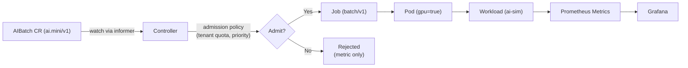

# 🧩 Mini Mistral Nodepool

A **minimal AI compute control plane** inspired by [Mistral Compute](https://mistral.ai/compute/).  

This demonstrates how an AI platform might orchestrate and monitor GPU-backed workloads natively on Kubernetes. I created this using custom resource, controller, and provided Prometheus metrics.

## Prerequisites

To run this locally you’ll need:

- **Docker** (Docker Desktop, Colima, or any compatible engine)
- **k3d** ≥ v5.5 - for running a lightweight Kubernetes cluster
- **kubectl**
- **make**
- **Go** ≥ 1.21 (optional, only if you want to edit and rebuild the controller)

All commands below assume these tools are installed and on your PATH.

## Quick start

### 1. Clone the repo
```
git clone https://github.com/muhammadrahim/mini-mistral-nodepool
cd mini-mistral-nodepool
```
### 2. Create a local k3d cluster

`make up`

### 3. Build and import controller image
```
make build
make import
```

### 4. Deploy manifests (CRD, RBAC, deployment, monitoring)
```
make roll
```
### 5. Check everything is running
```
kubectl -n app get pods
kubectl -n app get aibatches
```

## Concept

`Mini Mistral Nodepool` implements a lightweight control loop for AI batches:

1. **Users create** an `AIBatch` custom resource to describe a model workload.
2. A **controller** watches for new AIBatches.
3. It performs simple **admission control** (tenant quota, priority class).
4. When admitted, it **creates a Kubernetes Job** targeting GPU nodes.
5. The **Job runs a simulated AI task** (training/inference).
6. Metrics are exported to **Prometheus/Grafana** for observability.

My intent was to mirror what the orchestration and observability layer might look like internally for Mistral Compute.

## Architecture



See more in `/docs` file.

## Tech

- Go
- k3d to mimic a real k8s cluster
- Kubernetes CRD, priority classes, controller & jobs
- Observability: Grafana/Prometheus
- Docker