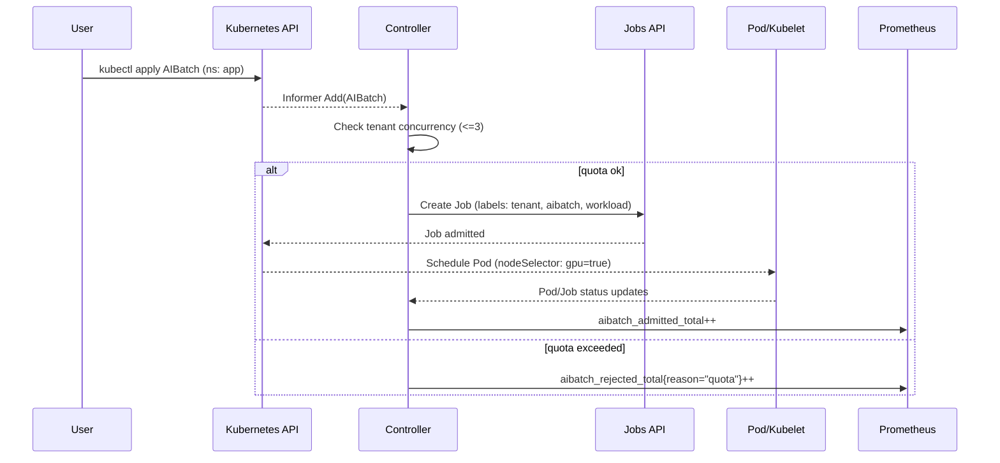

# Reconciliation Sequence

```mermaid
sequenceDiagram
    participant U as User
    participant K as Kubernetes API
    participant C as Controller
    participant J as Jobs API
    participant P as Pod/Kubelet
    participant M as Prometheus

    U->>K: kubectl apply AIBatch (ns: app)
    K-->>C: Informer Add(AIBatch)
    C->>C: Check tenant concurrency (<=3)
    alt quota ok
        C->>J: Create Job (labels: tenant, aibatch, workload)
        J-->>K: Job admitted
        K-->>P: Schedule Pod (nodeSelector: gpu=true)
        P-->>C: Pod/Job status updates
        C->>M: aibatch_admitted_total++
    else quota exceeded
        C->>M: aibatch_rejected_total{reason="quota"}++
    end
```